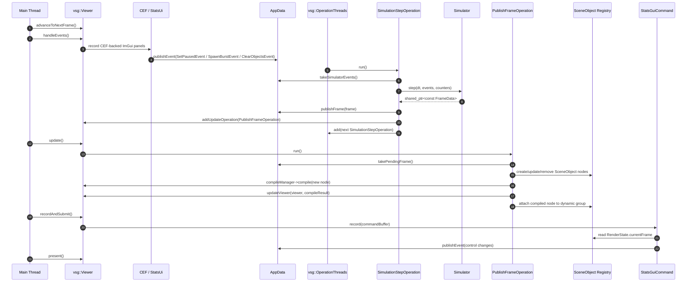
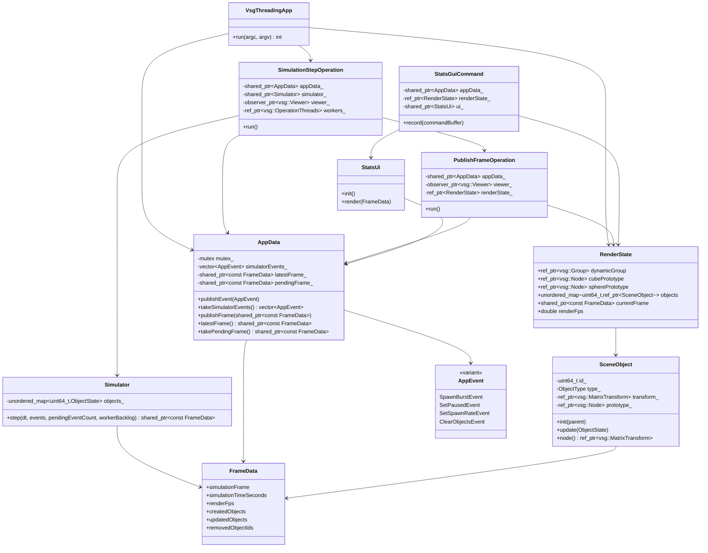

# vsgthreading Architecture

`vsgthreading` demonstrates a VSG-idiomatic threaded app:

- VSG viewer, event handlers, ImGui recording, and attached scene graph mutation stay on the main thread.
- Simulation runs as `vsg::Operation` work on `vsg::OperationThreads`.
- Worker operations publish immutable frame diffs.
- Main-thread update operations apply those diffs to VSG objects during `viewer->update()`.

## Sequence



## Classes



## Operation Creation

The app creates one `vsg::OperationThreads` instance:

```cpp
auto workers = vsg::OperationThreads::create(numWorkerThreads, viewer->status);
```

The first simulation operation is queued after `viewer->compile(...)`:

```cpp
workers->add(SimulationStepOperation::create(
    appData,
    simulator,
    vsg::observer_ptr<vsg::Viewer>(viewer),
    workers,
    renderState,
    Clock::now()));
```

`SimulationStepOperation` is a `vsg::Operation` subclass. Its `run()` method executes on a VSG worker thread. It:

- sleeps until the next fixed simulation tick,
- consumes pending app events from `AppData`,
- advances `Simulator::step(...)`,
- publishes the resulting immutable `FrameData`,
- schedules `PublishFrameOperation` with `viewer->addUpdateOperation(...)`,
- queues the next `SimulationStepOperation` back onto `OperationThreads`.

That last step keeps the simulator as VSG operation work instead of using an app-owned raw thread loop.

## Data Into The Simulator

Input and UI do not call simulator methods directly.

Main-thread producers publish `AppEvent` values. The CEF receive bridge should publish `SetPausedEvent`, `SetSpawnRateEvent`, `SpawnBurstEvent`, and `ClearObjectsEvent` after translating JavaScript messages.

`AppData::publishEvent(...)` stores those events behind a short mutex lock. The worker thread later calls `AppData::takeSimulatorEvents()`, which swaps the queue into a local vector. Physics never runs while holding the `AppData` mutex.

The simulator owns all mutable simulation state:

- object map,
- velocities,
- age/lifetime,
- spawn accumulator,
- pause/spawn-rate settings.

The simulator returns a `std::shared_ptr<const FrameData>`. After publication, that frame is treated as immutable.

## Data Back To Scene Objects

`FrameData` is a diff, not a full scene replacement:

- `createdObjects` contains new simulator ids that need VSG nodes.
- `updatedObjects` contains active object transforms/state updates.
- `removedObjectIds` contains ids that should be detached from the VSG group.

`PublishFrameOperation` runs from `viewer->update()` on the main thread. This is the point where attached scene graph mutation is allowed.

For new objects, `PublishFrameOperation`:

1. Creates a `SceneObject` with a shared cube or sphere prototype.
2. Updates its `vsg::MatrixTransform`.
3. Compiles the new node with `viewer->compileManager->compile(object->node())`.
4. Calls `updateViewer(*viewer, compileResult)`.
5. Attaches the compiled node to `RenderState.dynamicGroup`.
6. Stores it in `RenderState.objects` by simulator id.

For existing objects, it calls:

```cpp
sceneObject->update(objectState);
```

That updates only the `vsg::MatrixTransform` matrix. The simulator never touches VSG nodes.

For removed objects, it removes the node from the dynamic group and erases the registry entry.

## Data To CEF Panels

`StatsGuiCommand` is a `vsg::Command` passed to:

```cpp
vsgImGui::RenderImGui::create(window, StatsGuiCommand::create(appData, renderState));
```

During record traversal, `StatsGuiCommand::record(...)` reads `RenderState.currentFrame`, copies it to a local display frame, adds the current render FPS, and calls:

```cpp
ui_->render(displayFrame, commandBuffer.deviceID);
```

`StatsUi::render(...)` now renders two CEF browser surfaces inside ImGui windows:

- `CEF Stats Panel`, loading `cef_ui/stats.html`
- `CEF Sorting Form Panel`, loading `cef_ui/sorting-form.html`

The panels are React apps hosted by Chromium Embedded Framework in offscreen/windowless mode. CEF paints each browser into a BGRA pixel buffer. `StatsUi` copies that buffer into a dynamic VSG texture and draws it with `ImGui::Image(...)`.

The app keeps the swapchain and CEF texture path in linear UNORM formats:

- swapchain preference: `VK_FORMAT_B8G8R8A8_UNORM`
- CEF panel texture: `VK_FORMAT_B8G8R8A8_UNORM`

That avoids double sRGB correction and keeps the React/Chromium colors from appearing washed out.

### C++ To JavaScript

The current implemented bridge is C++ to JavaScript.

Each frame, `StatsUi::publishFrameDataToCef(...)` serializes the display `FrameData` to JSON and calls:

```cpp
cefUi_->executeJavaScript(vsgcef::CefSurfaceId::Stats, script);
cefUi_->executeJavaScript(vsgcef::CefSurfaceId::Sorting, script);
```

The executed JavaScript calls:

```js
window.vsgCef.receiveFrameData(frame)
```

The React stats panel uses that frame to update FPS, object counts, collision counts, and queue/backlog values. The sorting panel uses the same frame to update its live type counts.

This update is not a `vsg::Operation`. It happens from `StatsGuiCommand::record(...)`, which is already on the viewer/render path. It is a UI presentation update, not simulation work and not scene graph mutation.

### ImGui To CEF Input

Although the panels are drawn by ImGui, their controls are CEF/React controls. The ImGui window only provides the host rectangle and input capture.

`StatsUi` overlays an `ImGui::InvisibleButton(...)` over each CEF texture. It converts ImGui mouse coordinates to CEF browser pixel coordinates, then forwards:

- mouse move
- left/right/middle click down/up
- drag state
- mouse wheel
- focus
- typed characters and basic editing/navigation keys

Those events go to `CefUi::sendMouseMove(...)`, `sendMouseClick(...)`, `sendMouseWheel(...)`, `sendKey(...)`, and `sendKeyChar(...)`, which call CEF browser host APIs.

This is also not a `vsg::Operation`. It runs while ImGui records the UI. CEF processes the input through `CefDoMessageLoopWork()`, which the main loop calls once per frame before VSG event handling/update/render.

### JavaScript To C++

The React controls already emit messages using the browser-side `window.cefQuery(...)` shape:

```js
sendToCpp("setSpawnRate", { objectsPerSecond: value })
sendToCpp("spawnBurst", { count: 8 })
sendToCpp("clearObjects", {})
sendToCpp("mockSettingChanged", { id, value })
```

The C++ receive side is the next bridge piece to implement. The intended design is:

1. Add a CEF message router or process-message handler to `SurfaceClient`.
2. Parse the JSON request from JavaScript.
3. Convert simulation commands into existing `AppEvent` values.
4. Call `AppData::publishEvent(...)` on the browser/main thread.
5. Let the existing `SimulationStepOperation` consume those events with `AppData::takeSimulatorEvents()`.

So the C++ receive handler itself should not run the simulator and should not mutate VSG nodes. It should be a thin adapter from JavaScript messages to `AppEvent`.

The actual simulation response is still done with `vsg::Operation`: the worker-side `SimulationStepOperation` consumes the queued events and advances the simulator, then schedules `PublishFrameOperation` for main-thread VSG scene updates.

## Synchronization Rules

VSG handles synchronization for its own operation queues:

- `vsg::OperationQueue` is thread-safe.
- `vsg::OperationThreads` consumes `vsg::Operation` objects from that queue.
- `vsg::UpdateOperations` accepts operations from other threads and runs them during `viewer->update()`.

App-owned data still needs explicit synchronization:

- `AppData` uses a mutex for event queues and frame handoff.
- Locks are short: push, swap, or copy a shared pointer.
- Mutable simulator state is confined to the simulation operation thread.
- Mutable VSG scene state is confined to the main/update thread.
- ImGui reads the main-thread published `RenderState.currentFrame`.

The important rule is: VSG operations schedule work safely, but they do not automatically make arbitrary app objects thread-safe.

## Tracy Profiling

Tracy profiling is optional and is disabled by default. Enable it with:

```bash
cmake -S . -B build-tracy -DVSGCEF_ENABLE_TRACY=ON
cmake --build build-tracy --target vsgCef
```

By default the build looks for Tracy source at:

```text
../vkRaw/lightweightvk/third-party/deps/src/tracy
```

Override that with:

```bash
-DVSGCEF_TRACY_ROOT=/path/to/tracy
```

The app links Tracy only when `VSGCEF_ENABLE_TRACY=ON`. Normal builds compile the same profiling call sites to no-ops through `vsgthreading/Profiling.h`.

Current CPU zones cover:

- `vsgCef frame`
- `CefUi::doMessageLoopWork`
- `viewer->handleEvents`
- `viewer->update`
- `viewer->recordAndSubmit`
- `viewer->present`
- `SimulationStepOperation::run`
- `Simulator::step`
- `PublishFrameOperation::run`
- `StatsGuiCommand::record`
- `StatsUi::render`
- `StatsUi::publishFrameDataToCef`
- CEF JavaScript execution
- CEF offscreen paint copies
- CEF texture copy, texture wrapper creation, and texture compilation
- ImGui-to-CEF mouse and keyboard forwarding

Thread names are set for the main thread, simulation operation thread, and update operation path where those zones execute.

The current memory visibility is focused rather than global:

- `CEF stats paint bytes`
- `CEF sorting paint bytes`
- `CEF texture bytes`
- `CEF stats JSON bytes`
- `CEF ExecuteJavaScript bytes`

These plots make the recurring CEF pixel-buffer and JavaScript payload sizes visible without replacing the app allocator. If broader allocation tracking is needed later, the next step is to add Tracy allocation hooks or a custom allocator path around the high-churn CEF/VSG texture buffers.

The profiling model follows the threading model:

- simulation timing is measured inside `vsg::Operation` work,
- scene update timing is measured inside the update operation,
- CEF and ImGui timing is measured on the main/UI render path,
- CEF message-loop work is measured separately from VSG event/update/record/present phases.
