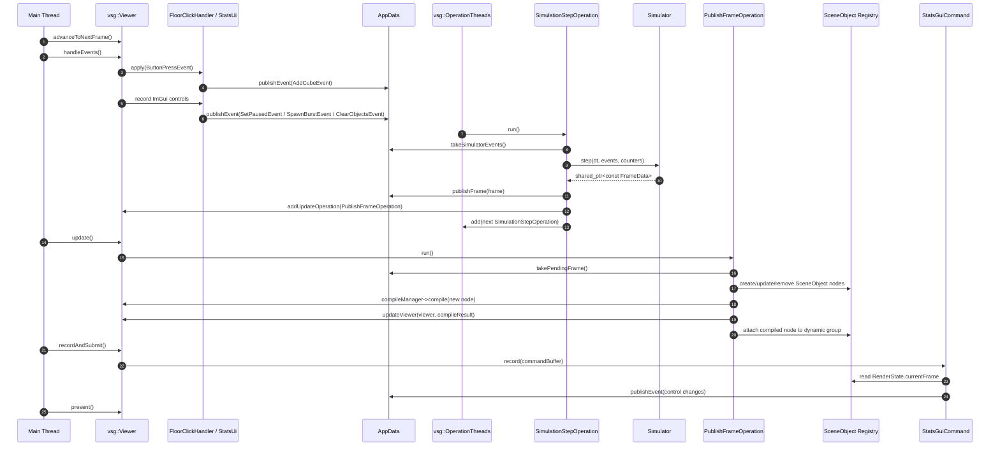
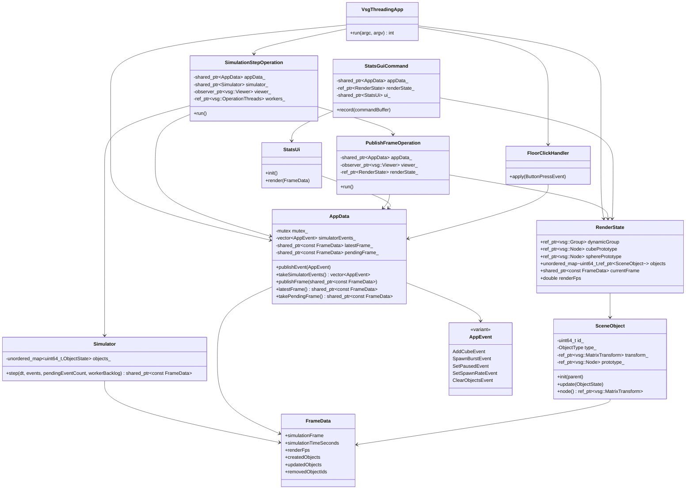

# vsgthreading Architecture

`vsgthreading` demonstrates a VSG-idiomatic threaded app:

- VSG viewer, event handlers, ImGui recording, and attached scene graph mutation stay on the main thread.
- Simulation runs as `vsg::Operation` work on `vsg::OperationThreads`.
- Worker operations publish immutable frame diffs.
- Main-thread update operations apply those diffs to VSG objects during `viewer->update()`.

## Sequence



## Classes



## Operation Creation

The app creates one `vsg::OperationThreads` instance:

```cpp
auto workers = vsg::OperationThreads::create(numWorkerThreads, viewer->status);
```

The first simulation operation is queued after `viewer->compile(...)`:

```cpp
workers->add(SimulationStepOperation::create(
    appData,
    simulator,
    vsg::observer_ptr<vsg::Viewer>(viewer),
    workers,
    renderState,
    Clock::now()));
```

`SimulationStepOperation` is a `vsg::Operation` subclass. Its `run()` method executes on a VSG worker thread. It:

- sleeps until the next fixed simulation tick,
- consumes pending app events from `AppData`,
- advances `Simulator::step(...)`,
- publishes the resulting immutable `FrameData`,
- schedules `PublishFrameOperation` with `viewer->addUpdateOperation(...)`,
- queues the next `SimulationStepOperation` back onto `OperationThreads`.

That last step keeps the simulator as VSG operation work instead of using an app-owned raw thread loop.

## Data Into The Simulator

Input and UI do not call simulator methods directly.

Main-thread producers publish `AppEvent` values:

- `FloorClickHandler` publishes `AddCubeEvent`.
- `StatsUi` publishes `SetPausedEvent`, `SetSpawnRateEvent`, `SpawnBurstEvent`, and `ClearObjectsEvent`.

`AppData::publishEvent(...)` stores those events behind a short mutex lock. The worker thread later calls `AppData::takeSimulatorEvents()`, which swaps the queue into a local vector. Physics never runs while holding the `AppData` mutex.

The simulator owns all mutable simulation state:

- object map,
- velocities,
- age/lifetime,
- spawn accumulator,
- pause/spawn-rate settings.

The simulator returns a `std::shared_ptr<const FrameData>`. After publication, that frame is treated as immutable.

## Data Back To Scene Objects

`FrameData` is a diff, not a full scene replacement:

- `createdObjects` contains new simulator ids that need VSG nodes.
- `updatedObjects` contains active object transforms/state updates.
- `removedObjectIds` contains ids that should be detached from the VSG group.

`PublishFrameOperation` runs from `viewer->update()` on the main thread. This is the point where attached scene graph mutation is allowed.

For new objects, `PublishFrameOperation`:

1. Creates a `SceneObject` with a shared cube or sphere prototype.
2. Updates its `vsg::MatrixTransform`.
3. Compiles the new node with `viewer->compileManager->compile(object->node())`.
4. Calls `updateViewer(*viewer, compileResult)`.
5. Attaches the compiled node to `RenderState.dynamicGroup`.
6. Stores it in `RenderState.objects` by simulator id.

For existing objects, it calls:

```cpp
sceneObject->update(objectState);
```

That updates only the `vsg::MatrixTransform` matrix. The simulator never touches VSG nodes.

For removed objects, it removes the node from the dynamic group and erases the registry entry.

## Data To ImGui

`StatsGuiCommand` is a `vsg::Command` passed to:

```cpp
vsgImGui::RenderImGui::create(window, StatsGuiCommand::create(appData, renderState));
```

During record traversal, `StatsGuiCommand::record(...)` reads `RenderState.currentFrame`, copies it to a local display frame, adds the current render FPS, and calls:

```cpp
ui_->render(displayFrame);
```

`StatsUi::render(...)` displays frame stats and publishes UI control changes as `AppEvent` messages. Those UI events follow the same path as floor-click events: `StatsUi -> AppData -> SimulationStepOperation -> Simulator`.

## Synchronization Rules

VSG handles synchronization for its own operation queues:

- `vsg::OperationQueue` is thread-safe.
- `vsg::OperationThreads` consumes `vsg::Operation` objects from that queue.
- `vsg::UpdateOperations` accepts operations from other threads and runs them during `viewer->update()`.

App-owned data still needs explicit synchronization:

- `AppData` uses a mutex for event queues and frame handoff.
- Locks are short: push, swap, or copy a shared pointer.
- Mutable simulator state is confined to the simulation operation thread.
- Mutable VSG scene state is confined to the main/update thread.
- ImGui reads the main-thread published `RenderState.currentFrame`.

The important rule is: VSG operations schedule work safely, but they do not automatically make arbitrary app objects thread-safe.
